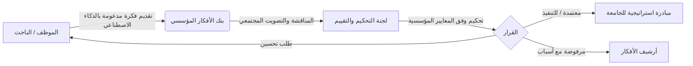
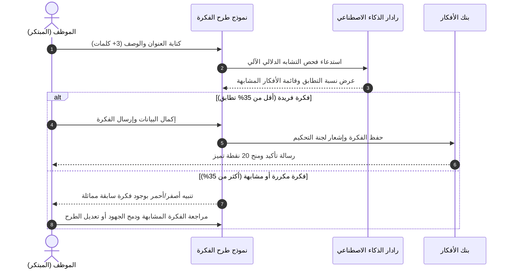

# دليل المستخدم لمنصة فكرة (Fikra User Manual)
### منصة إدارة الابتكار والأفكار المؤسسية — جامعة بيشة (University of Bisha)
**الإصدار:** 2.0 | **التاريخ:** سبتمبر 2026 | **الحالة:** معتمد

---

## 📑 جدول المحتويات (Table of Contents)
1. [مقدمة ونظرة عامة](#1-مقدمة-ونظرة-عامة)
2. [متطلبات التشغيل والوصول للمنصة](#2-متطلبات-التشغيل-والوصول-للمنصة)
3. [واجهة المستخدم وتخصيص التجربة](#3-واجهة-المستخدم-وتخصيص-التجربة)
4. [تسجيل الدخول وإدارة الحساب](#4-تسجيل-الدخول-وإدارة-الحساب)
5. [دليل الموظف والمبتكر (Employee Guide)](#5-دليل-الموظف-والمبتكر-employee-guide)
   - تقديم فكرة جديدة
   - استخدام ميزة الإدخال الصوتي (Speech-to-Text)
   - التفاعل مع رادار الذكاء الاصطناعي لكشف الأفكار المتشابهة (AI Duplicate Radar)
   - استعراض ومتابعة أفكاري وتتبع دورة حياتها
6. [بنك الأفكار والتفاعل المجتمعي (Ideas Hub)](#6-بنك-الأفكار-والتفاعل-المجتمعي-ideas-hub)
   - البحث والتصفية والفرز
   - التصويت والتعليقات والمناقشات
   - طباعة وثيقة الفكرة وتصديرها بصيغة PDF
7. [لوحة الشرف ونظام النقاط (Gamification & Leaderboard)](#7-لوحة-الشرف-ونظام-النقاط-gamification--leaderboard)
8. [دليل عضو لجنة التحكيم (Committee Evaluator Guide)](#8-دليل-عضو-لجنة-التحكيم-committee-evaluator-guide)
   - استعراض الأفكار الواردة للتقييم
   - مصفوفة المعايير الرباعية والتقييم بالأوزان
   - إصدار القرار الرسمي وتدوين الملاحظات
9. [الأسئلة الشائعة والدعم الفني (FAQ & Support)](#9-الأسئلة-الشائعة-والدعم-الفني-faq--support)

---

## 1. مقدمة ونظرة عامة
**منصة فكرة (Fikra)** هي المنصة الرقمية الموحدة لجامعة بيشة التي تهدف إلى تمكين أعضاء هيئة التدريس، الكادر الإداري، والباحثين من طرح المبادرات والأفكار الابتكارية، والمساهمة الفاعلة في تحقيق أهداف الخطة الاستراتيجية للجامعة ورؤية المملكة 2030.

---

## 2. متطلبات التشغيل والوصول للمنصة
- **المتصفحات المدعومة:** Google Chrome (إصدار 100 فما فوق)، Microsoft Edge، Apple Safari، Mozilla Firefox.
- **الأجهزة المدعومة:** متوافقة مع جميع شاشات الحواسيب المكتبية والمحمولة، والأجهزة اللوحية (iPad/Tablets)، والهواتف الذكية (iOS & Android).
- **إمكانية الوصول:** عبر شبكة الجامعة الداخلية أو عبر الإنترنت العام مع دعم المزامنة السحابية المباشرة (Supabase Cloud Sync).

---

## 3. واجهة المستخدم وتخصيص التجربة
تتميز المنصة بهوية جامعة بيشة البصرية الرسمية (الأخضر الملكي `#14573A` والذهبي `#C5A059`)، وتوفر خيارات التخصيص التالية في الشريط العلوي (Header):
- **تبديل اللغة (Language Switch):** يدعم النظام التبديل الفوري بين **العربية (RTL)** و **الإنجليزية (LTR)** مع تعريب كامل لجميع النصوص والعناصر.
- **تبديل الوضع الليلي (Dark/Light Mode):** بالضغط على أيقونة الشمس/القمر للتبديل بين السمة الفاتحة والسمة الداكنة المريحة للعين.
- **مؤشر الاتصال السحابي (Cloud Sync Status):** يعرض مؤشر الاتصال المباشر بقاعدة بيانات Supabase لضمان مزامنة البيانات بين الجلسات.

---

## 4. تسجيل الدخول وإدارة الحساب

### 4.1. تسجيل الدخول بنمط SSO
1. افتح صفحة النظام، انقر على زر **تسجيل الدخول (Login)** في الشريط العلوي.
2. أدخل **البريد الإلكتروني الجامعي** (مثل `employee@ub.edu.sa`) و**كلمة المرور**.
3. أو اختر أحد الحسابات التجريبية الجاهزة للتجربة السريعة بنقرة واحدة (شريط التبديل السريع):
   - **موظف / مبتكر:** `employee@ub.edu.sa`
   - **عضو لجنة تحكيم:** `committee@ub.edu.sa`
   - **مدير النظام:** `admin@ub.edu.sa`

### 4.2. تسجيل حساب منسوب جديد
1. اضغط على رابط **إنشاء حساب جديد**.
2. عبّئ البيانات الشخصية (الاسم الرباعي، الرقم الوظيفي، الكلية/العمادة، المسمى الوظيفي).
3. اختر كلمة مرور قوية (تحتوي على أحرف كبيرة وصغيرة وأرقام ورموز وفق مقياس الأمان الحي).
4. اضغط **تسجيل الحساب**.

### 4.3. استعادة كلمة المرور
1. اضغط على رابط **نسيت كلمة المرور؟**.
2. أدخل بريدك الإلكتروني الجامعي، ثم أدخل رمز التحقق المستلم (OTP) لتعيين كلمة مرور جديدة فورياً.

---

## 5. دليل الموظف والمبتكر (Employee Guide)

### 5.1. تقديم فكرة جديدة
1. اضغط على زر **طرح فكرة جديدة (+ Add Idea)** من القائمة العلوية أو من زر الإجراء السريع.
2. حدد **الكلية أو الجهة المستهدفة** بتطبيق الفكرة، واختر **مجال الفكرة** (التحول الرقمي، الاستدامة والبيئة، جودة التعليم، إلخ).
3. اكتب **عنوان الفكرة** ووصفها المفصل، وحدد **الأثر المتوقع والميزانية التقديرية**.

### 5.2. الإدخال الصوتي (Speech-to-Text)
- انقر على أيقونة **الميكروفون** بجوار حقل العنوان أو الوصف.
- امنح المتصفح إذن الوصول للميكروفون، وتحدث باللغة العربية أو الإنجليزية.
- سيقوم المحرك الصوتي الذكي بتحويل الحديث مباشرة إلى نص مكتوب داخل الحقل مع عرض تموجات صوتية تفاعلية.

### 5.3. رادار الذكاء الاصطناعي لاكتشاف التشابه (AI Radar)
- بمجرد كتابة **3 كلمات أو أكثر**، يقوم النظام تلقائياً بفحص بنك الأفكار المؤسسي ومطابقة الكلمات المفتاحية والجذور اللغوية.
- يعرض الرادار شريطاً يبين **نسبة التشابه**، وفي حال وجود أفكار مشابهة يتيح لك فتح نافذة المقارنة جنبًا إلى جنب لتجنب تكرار الجهود والاستفادة من المقترحات المطروحة مسبقاً.

### 5.4. متابعة أفكاري وتتبع دورة الحياة
- من تبويب **أفكاري (My Ideas)**، يمكنك متابعة حالة كل فكرة:
  - 🟡 **قيد المراجعة (Under Review):** تم استلام الفكرة وهي لدى لجنة التحكيم.
  - 🟢 **معتمدة (Approved):** تمت الموافقة على الفكرة ونقلها لمرحلة التخطيط والتنفيذ.
  - 🟠 **طلب تعديل (Revision Needed):** طلبت اللجنة إيضاحات أو دراسة جدوى إضافية.
  - 🔴 **مرفوضة (Rejected):** تم توضيح أسباب عدم القبول مع إمكانية الاطلاع على تقرير التحكيم.
  - 🔵 **قيد التنفيذ / مكتملة (Implemented):** تحولت الفكرة إلى مشروع مؤسسي فعلي على أرض الواقع.

---

## 6. بنك الأفكار والتفاعل المجتمعي (Ideas Hub)

| الإجراء | الوصف وكيفية الاستخدام |
| :--- | :--- |
| **التصفية المتقدمة** | تصفية الأفكار حسب: الكلية/العمادة، المجال، حالة الفكرة (معتمدة، قيد المراجعة)، والترتيب (الأحدث، الأكثر تصويتاً، الأعلى أثراً). |
| **التصويت الإيجابي / السلبي** | الضغط على زر الإعجاب لدعم الفكرة. يمنع النظام تكرار التصويت من نفس الحساب ويحدّث العداد فورياً. |
| **التعليقات وإثراء الأفكار** | كتابة ملاحظات ومقترحات تطويرية أسفل كل فكرة للمساهمة في إنضاجها قبل التحكيم النهائي. |
| **تصدير وثيقة الفكرة (PDF Export)** | الضغط على زر **طباعة / تصدير PDF** لإنشاء تقرير رسمي منسق بهوية جامعة بيشة يحتوي على كامل تفاصيل الفكرة، وبيانات صاحبها، وتقييم الذكاء الاصطناعي. |

---

## 7. لوحة الشرف ونظام النقاط (Gamification & Leaderboard)
تشجع المنصة التنافس الإيجابي من خلال منح الموظفين والكليات نقاطاً وأوسمة وفق جدول الأنشطة التالي:

| النشاط المنجز | النقاط المكتسبة | الوسام المستحق |
| :--- | :---: | :--- |
| **تقديم فكرة جديدة** | +20 نقطة | 💡 مبتكر نشط (Active Innovator) |
| **اعتماد الفكرة من لجنة التحكيم** | +50 نقطة | 🏆 فكرة استراتيجية (Strategic Idea) |
| **تحويل الفكرة إلى مشروع منفذ** | +100 نقطة | 🌟 بطل الابتكار (Innovation Champion) |
| **المشاركة الفاعلة بالتصويت والتعليق** | +5 نقاط | 🤝 مجتمع ابتكاري (Collaborator) |

---

## 8. دليل عضو لجنة التحكيم (Committee Evaluator Guide)

### 8.1. الوصول لبوابة التحكيم
عند تسجيل الدخول بحساب يحمل دور **لجنة تحكيم (Committee)**، يظهر تبويب **بوابة التحكيم (Review Portal)** في القائمة الرئيسية.

### 8.2. مصفوفة المعايير الرباعية
تُقيّم كل فكرة بناءً على 4 معايير معتمدة بمقياس من 1 إلى 5 نجوم (مع ترجيح أوزان آلي):
1. **المواءمة الاستراتيجية (Strategic Alignment - 30%):** مدى ارتباط الفكرة بأهداف جامعة بيشة ورؤية 2030.
2. **درجة الابتكار والأصالة (Innovation & Novelty - 25%):** حداثة الفكرة وتفرد أسلوب المعالجة.
3. **قابلية التطبيق والجدوى (Feasibility & Execution - 25%):** وضوح خطة التنفيذ وتوافر الموارد والميزانية.
4. **العائد والأثر المؤسسي (Institutional Impact - 20%):** حجم الشريحة المستفيدة والوفر المالي أو التحسين النوعي.

### 8.3. اتخاذ القرار وتدوين التوصية
1. بعد رصد الدرجات الأربع، يُحسب المجموع العام آلياً من 100%.
2. يختار المحكم أحد القرارات الرسمية:
   - ✅ **اعتماد الفكرة (Approve)**
   - 🔄 **طلب تعديلات إضافية (Request Revision)**
   - ❌ **عدم الموافقة (Reject)**
3. كتابة **الملاحظات الرسمية والتوجيهات** التي ستصل لصاحب الفكرة في إشعاراته وملفه الشخصي.
4. الضغط على **حفظ واعتماد التقييم**.

---

## 9. الأسئلة الشائعة والدعم الفني (FAQ & Support)
- **س: هل يمكنني تعديل الفكرة بعد إرسالها؟**
  - ج: نعم، ما دامت الفكرة في حالة "قيد المراجعة" ولم تبدأ اللجنة في إصدار القرار النهائي.
- **س: ماذا يحدث إذا اكتشف الذكاء الاصطناعي فكرة مطابقة لفكرتي؟**
  - ج: ينصح النظام بمراجعة الفكرة القائمة، وإذا كانت فكرتك تضيف جانباً جديداً يمكنك توضيح نقطة التميز في حقل الوصف.
- **س: كيف يتم اختيار الفائزين في لوحة الشرف؟**
  - ج: يتم احتساب الترتيب آلياً بناءً على مجموع النقاط وجودة الأفكار المعتمدة شهرياً وسنوياً.
- **للتواصل مع الدعم الفني:** عمادة تقنية المعلومات — جامعة بيشة | البريد: `support-fikra@ub.edu.sa`.
