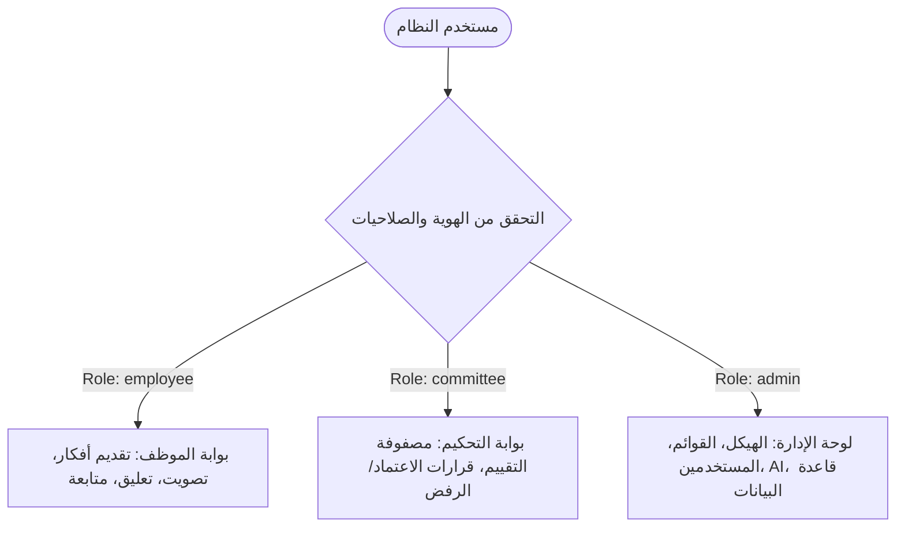
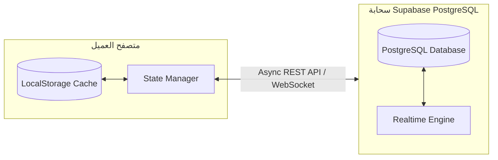

# دليل إدارة النظام (System Administration Guide)
### منصة فكرة (Fikra) — جامعة بيشة | University of Bisha
**الإصدار:** 2.0 | **التاريخ:** سبتمبر 2026 | **المستوى الأمني:** سري للمشرفين والمطورين (Internal Admin Only)

---

## 📑 جدول المحتويات (Table of Contents)
1. [نظرة عامة على صلاحيات الإدارة](#1-نظرة-عامة-على-صلاحيات-الإدارة)
2. [نموذج التحكم بالوصول المبني على الأدوار (RBAC Matrix)](#2-نموذج-التحكم-بالوصول-المبني-على-الأدوار-rbac-matrix)
3. [إدارة القوائم المنسدلة الديناميكية (Dynamic Dropdowns Management)](#3-إدارة-القوائم-المنسدلة-الديناميكية-dynamic-dropdowns-management)
   - إدارة الكليات والعمادات والإدارات (Colleges & Deanships)
   - إدارة المسميات الوظيفية (Job Titles)
   - إدارة تصنيفات ومجالات الابتكار (Idea Categories)
4. [إدارة المستخدمين والحسابات (User & Role Management)](#4-إدارة-المستخدمين-والحسابات-user--role-management)
5. [ضبط معايير الذكاء الاصطناعي (AI Similarity & Threshold Settings)](#5-ضبط-معايير-الذكاء-الاصطناعي-ai-similarity--threshold-settings)
6. [إدارة قاعدة البيانات والمزامنة السحابية (Supabase Cloud Sync Management)](#6-إدارة-قاعدة-البيانات-والمزامنة-السحابية-supabase-cloud-sync-management)
7. [البيانات الأولية وإعادة الضبط المصنعي (Seed Data & Reset Procedures)](#7-البيانات-الأولية-وإعادة-الضبط-المصنعي-seed-data--reset-procedures)
8. [سجلات التدقيق والأمان وإدارة المخاطر (Audit & Security)](#8-سجلات-التدقيق-والأمان-وإدارة-المخاطر-audit--security)
9. [إجراءات الصيانة واستكشاف الأعطال (Maintenance & Troubleshooting)](#9-إجراءات-الصيانة-واستكشاف-الأعطال-maintenance--troubleshooting)

---

## 1. نظرة عامة على صلاحيات الإدارة
لوحة تحكم مدير النظام (**Admin Portal**) هي الواجهة المركزية المسؤولة عن تهيئة النظام المؤسسي، إدارة الهياكل الأكاديمية والإدارية، تعيين صلاحيات المحكمين، ومراقبة التكامل مع البنية التحتية السحابية (Cloud Database / Supabase) لمحرك الابتكار في جامعة بيشة.

---

## 2. نموذج التحكم بالوصول المبني على الأدوار (RBAC Matrix)

| الوظيفة / الإجراء | الموظف (Employee) | المحكم (Committee) | مدير النظام (Admin) |
| :--- | :---: | :---: | :---: |
| **طرح فكرة جديدة واستخدام رادار الذكاء الاصطناعي** | ✅ | ✅ | ✅ |
| **التصويت والتعليق ومناقشة الأفكار** | ✅ | ✅ | ✅ |
| **تصدير وطباعة بطاقة الفكرة الرسمية (PDF)** | ✅ | ✅ | ✅ |
| **الوصول لبوابة لجان التحكيم والتقييم** | ❌ | ✅ | ✅ |
| **إصدار قرارات الاعتماد والرفض وتعديل حالة الفكرة** | ❌ | ✅ | ✅ |
| **إضافة/تعديل/حذف الكليات والعمادات** | ❌ | ❌ | ✅ |
| **إدارة وتعديل المسميات الوظيفية والمجالات** | ❌ | ❌ | ✅ |
| **تعديل أدوار المستخدمين وتفعيل/تعطيل الحسابات** | ❌ | ❌ | ✅ |
| **ضبط حساسية خوارزمية التشابه الدلالي (AI Threshold)** | ❌ | ❌ | ✅ |
| **إجراء المزامنة القسرية وإعادة ضبط البيانات الأولية** | ❌ | ❌ | ✅ |

---

## 3. إدارة القوائم المنسدلة الديناميكية (Dynamic Dropdowns Management)

### 3.1. إدارة الكليات والعمادات (Departments & Colleges)
يتيح تبويب **الكليات والإدارات** لمدير النظام إضافة أي كيان تنظيمي جديد بالجامعة دون الحاجة لتعديل الكود المصدري:
- **الحقول الإلزامية:**
  - `Code`: الرمز التنظيمي (مثل `CS_IS`، `ENG`، `MED`، `DSR`).
  - `Arabic Name`: الاسم الرسمي بالعربية (مثل: *كلية الحاسب الآلي ونظم المعلومات*).
  - `English Name`: الاسم بالإنجليزية (مثل: *College of Computer Science & Information Systems*).
  - `Type`: نوع الكيان (`college` أو `deanship` أو `admin_dept`).
- **التأثير الفوري:** تنعكس الإضافة والتعديل تلقائياً في شاشات تسجيل الموظفين الجدد، وفلاتر بنك الأفكار، ونماذج التقديم.

### 3.2. إدارة المسميات الوظيفية (Job Titles)
- تسمح بضبط الرتب الأكاديمية والوظائف الإدارية (مثل: *أستاذ دكتور، أستاذ مشارك، أستاذ مساعد، محاضر، معيد، مهندس برمجيات، أخصائي جودة*).
- يمكن للمدير إضافة رتب جديدة مع دعم التسمية الثنائية (عربي/إنجليزي).

### 3.3. إدارة تصنيفات ومجالات الأفكار (Idea Categories)
- تحديد مسارات المبادرات مثل: *التحول الرقمي والذكاء الاصطناعي*، *الاستدامة والبيئة الخضراء*، *تطوير البحث العلمي*، *الكفاءة المالية والتشغيلية*، *خدمة المجتمع*.
- تخصيص أيقونة تعبيرية (Icon) ولون مميز لكل تصنيف لتظهر بشكل جذاب في بطاقات الأفكار.

---

## 4. إدارة المستخدمين والحسابات (User & Role Management)

1. الانتقال إلى تبويب **المستخدمين (Users)** في لوحة الإدارة.
2. استعراض قائمة كافة منسوبي الجامعة المسجلين مع عرض:
   - الاسم والبريد الإلكتروني الجامعي.
   - الكلية / الإدارة والمسمى الوظيفي.
   - الدور الحالي (`employee`, `committee`, `admin`).
   - عدد الأفكار المقدمة ورصيد النقاط التراكمي.
3. **تعديل صلاحية مستخدم:**
   - الضغط على أيقونة التعديل واختيار الدور الجديد من القائمة المنسدلة ثم الضغط على **حفظ**.
   - يتم تحديث جلسة المستخدم فوراً ومنحه الوصول للبوابات المعنية (مثل بوابة لجان التحكيم).
4. **إضافة مستخدم جديد يدوياً:** إدخال البريد الإلكتروني والاسم وتحديد الدور مباشرة.

---

## 5. ضبط معايير الذكاء الاصطناعي (AI Similarity & Threshold Settings)

توفر لوحة إدارة الذكاء الاصطناعي إمكانية موازنة دقة واكتشاف التشابه بين الأفكار:

| المعامل (Parameter) | القيمة الافتراضية | النطاق المتاح | الوصف والأثر التشغيلي |
| :--- | :---: | :---: | :--- |
| **عتبة التشابه (Similarity Threshold)** | `0.35` (35%) | `0.10 - 0.90` | النسبة الحدية التي يبدأ عندها النظام في إظهار تنبيه الموظف بوجود أفكار سابقة مشابهة. تقليل النسبة يزيد حساسية الرادار. |
| **الحد الأدنى للكلمات المفتاحية** | `3` كلمات | `1 - 10` | عدد الكلمات المطلوبة في العنوان أو الوصف قبل تفعيل محرك البحث الدلالي في الخلفية. |
| **مفتاح واجهة Gemini API (اختياري)** | فارغ (محرك مدمج) | نص سري | في حال الرغبة بربط النظام مع Google Gemini Pro لتحليل متقدم وتلخيص آلي عبر السحابة. |
| **المحرك الاحتياطي المحلي (Offline NLP)** | مفعّل دائماً | نعم / لا | يضمن عمل رادار التشابه بنسبة 100% حتى في حال انقطاع الإنترنت أو عدم توفر مفاتيح API الخارجية. |

---

## 6. إدارة قاعدة البيانات والمزامنة السحابية (Supabase Cloud Sync Management)

تم تجهيز المنصة بنظام مزامنة هجين (Hybrid Sync Engine) يجمع بين سرعة التخزين المحلي `LocalStorage` وموثوقية قاعدة بيانات PostgreSQL السحابية المباشرة في **Supabase**:

### 6.1. أدوات إدارة قاعدة البيانات المتوفرة للمدير:
- **فحص الاتصال (Test Cloud Connection):** التحقق من استجابة خادم Supabase وزمن الوصول (Latency).
- **المزامنة القسرية (Force Push to Cloud):** رفع كافة البيانات المحلية (الأفكار، التقييمات، التصنيفات، المستخدمين) إلى السحابة فوراً.
- **إعادة الجلب من السحابة (Pull from Cloud):** تنزيل أحدث نسخة من البيانات ومطابقة المتصفح مع السيرفر السحابي.

---

## 7. البيانات الأولية وإعادة الضبط المصنعي (Seed Data & Reset Procedures)

> [!CAUTION]
> يؤدي إجراء "إعادة ضبط البيانات الأولية (Reset to Factory Seed Data)" إلى مسح التعديلات المحلية غير المحفوظة واستعادة هيكل جامعة بيشة الافتراضي مع بيانات تجريبية للأفكار والمحكمين.

### خطوات تنفيذ إعادة الضبط:
1. الدخول إلى تبويب **إدارة النظام**.
2. الضغط على زر **إعادة ضبط البيانات الأولية (Reset Seed Data)** في أعلى اليسار.
3. ستظهر نافذة تأكيد تحذيرية؛ عند التأكيد يقوم النظام بإنشاء:
   - 6 كليات وعمادات رئيسية لجامعة بيشة.
   - 6 مسميات وظيفية قياسية.
   - 6 تصنيفات ابتكارية معتمدة.
   - 3 حسابات تجريبية موثقة (موظف، محكم، مدير).
   - 4 أفكار تطويرية نموذجية متكاملة التقييمات والتصويت.

---

## 8. سجلات التدقيق والأمان وإدارة المخاطر (Audit & Security)
- **تشفير الجلسات:** تُخزن الجلسات محلياً مع توقيع الرموز (Tokens) لمنع التلاعب.
- **التحقق من صحة المدخلات (Input Sanitization):** تنظيف كافة الحقول النصية لمنع هجمات XSS و Injection.
- **حماية التصويت والتقييم:** منع تكرار التصويت عبر تقييد معرف المستخدم الفريد `userId` لكل فكرة.
- **سياسة كلمات المرور:** فرض 8 خانات كحد أدنى تحتوي على أحرف وأرقام مع مؤشر تحقق مرئي فوري.

---

## 9. إجراءات الصيانة واستكشاف الأعطال (Maintenance & Troubleshooting)

| المشكلة | السبب المحتمل | الحل والإجراء التصحيحي |
| :--- | :--- | :--- |
| **مؤشر Supabase يظهر باللون الرمادي أو الأحمر** | انقطاع اتصال الإنترنت أو حظر الـ CORS على الشبكة المحلية | يعمل النظام تلقائياً عبر التخزين المحلي الآمن. تحقق من الاتصال ثم اضغط **فحص الاتصال** في لوحة الإدارة. |
| **تكرار ظهور تنبيه التشابه لفكرة جديدة كلياً** | عتبة التشابه منخفضة جداً (أقل من 0.20) | ارفع عتبة التشابه إلى `0.35` أو `0.40` من تبويب إعدادات الذكاء الاصطناعي. |
| **فقدان صلاحيات المحكم بعد تسجيل الدخول** | الحساب مسجل بدور `employee` | افتح لوحة الإدارة بحساب المدير، توجه لتبويب المستخدمين، وعدّل دور الحساب إلى `committee`. |
