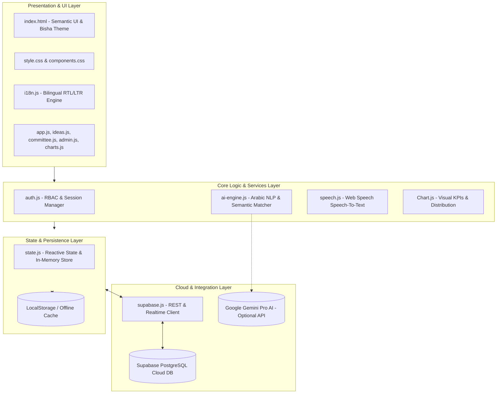
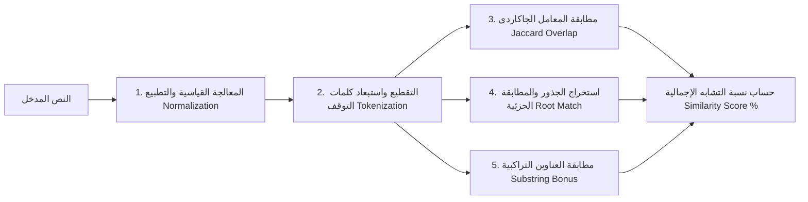
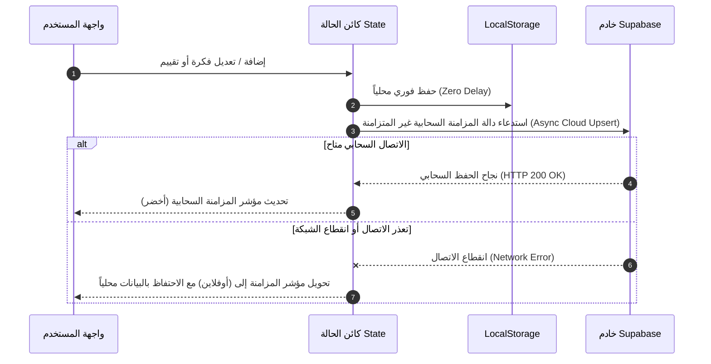

# وثيقة معمارية البرمجيات (Software Architecture Document - SAD)
### منصة فكرة (Fikra) — جامعة بيشة | University of Bisha
**الإصدار:** 2.0 | **التاريخ:** سبتمبر 2026 | **المعايير المتبعة:** IEEE 1471 / ISO/IEC/IEEE 42010

---

## 📑 جدول المحتويات (Table of Contents)
1. [مقدمة وأهداف المعمارية (Introduction & Goals)](#1-مقدمة-وأهداف-المعمارية-introduction--goals)
2. [الأنماط والمبادئ المعمارية (Architectural Patterns & Principles)](#2-الأنماط-والمبادئ-المعمارية-architectural-patterns--principles)
3. [المخطط المعماري عالي المستوى (High-Level Architecture Overview)](#3-المخطط-المعماري-عالي-المستوى-high-level-architecture-overview)
4. [تفكيك المكونات البرمجية (Component Decomposition)](#4-تفكيك-المكونات-البرمجية-component-decomposition)
5. [معمارية محرك الذكاء الاصطناعي ومعالجة اللغات الطبيعية (AI & NLP Pipeline)](#5-معمارية-محرك-الذكاء-الاصطناعي-ومعالجة-اللغات-الطبيعية-ai--nlp-pipeline)
6. [معمارية المزامنة وتدفق البيانات (Data Synchronization & Flow Architecture)](#6-معمارية-المزامنة-وتدفق-البيانات-data-synchronization--flow-architecture)
7. [الأمان وإدارة الهوية (Security & Identity Architecture)](#7-الأمان-وإدارة-الهوية-security--identity-architecture)
8. [الخصائص غير الوظيفية (Non-Functional Requirements)](#8-الخصائص-غير-الوظيفية-non-functional-requirements)
9. [معمارية النشر والتوزيع (Deployment & Infrastructure Architecture)](#9-معمارية-النشر-والتوزيع-deployment--infrastructure-architecture)

---

## 1. مقدمة وأهداف المعمارية (Introduction & Goals)
تم تصميم البنية المعمارية لمنصة **فكرة (Fikra)** لتوفير نظام خفيف الوزن وعالي الاستجابة ومنعدم زمن التأخير (Zero-latency) لإدارة الأفكار المؤسسية والابتكارية في بيئة جامعة بيشة الأكاديمية.

### الأهداف الاستراتيجية للمعمارية:
- **الاستقلالية وعدم الاعتمادية القسرية على السيرفرات:** إمكانية تشغيل المنصة فورياً على متصفح العميل (Zero Build Tooling Dependency).
- **المعالجة اللغوية المباشرة (Client-Side Real-time NLP):** تنفيذ خوارزميات الذكاء الاصطناعي للتشابه الدلالي محلياً دون الحاجة لانتظار استجابة شبكية لكل كلمة.
- **التخزين الهجين والمزامنة السحابية (Hybrid Local + Cloud Persistence):** دعم العمل دون اتصال (Offline-first) مع المزامنة التلقائية لبيانات PostgreSQL عبر Supabase.

---

## 2. الأنماط والمبادئ المعمارية (Architectural Patterns & Principles)
1. **نمط التطبيق وحيد الصفحة (Single Page Application - SPA):** هيكل مكونات تفاعلي يعتمد على Vanilla JavaScript الحديث (ES6+)، مع توجيه ديناميكي للأقسام وتبديل شاشات سلس دون إعادة تحميل الصفحة (DOM Replacement Pattern).
2. **فصل المسؤوليات (Separation of Concerns - SoC):** فصل طبقة العرض والواجهات (`app.js`, `index.html`, `css/`) عن إدارة الحالة (`state.js`) وعن الخدمات الخارجية (`supabase.js`, `ai-engine.js`, `speech.js`).
3. **نموذج مصدر الحقيقة الموحد (Single Source of Truth - SSOT):** كائن الحالة العام `State` هو المرجع الوحيد لبيانات التطبيق أثناء التشغيل، مع آليات حفظ ثنائية (Storage & Cloud).

---

## 3. المخطط المعماري عالي المستوى (High-Level Architecture Overview)

---

## 4. تفكيك المكونات البرمجية (Component Decomposition)

| المكون (Component) | الملف المسؤول | الدور والمسؤولية |
| :--- | :--- | :--- |
| **إدارة الحالة (State Manager)** | `js/state.js` | إدارة التخزين، التهيئة الأولية للبيانات، إدارة مصفوفات الكليات والمستخدمين والأفكار وتتبع التغييرات. |
| **محرك الذكاء الاصطناعي (AI Engine)** | `js/ai-engine.js` | المعالجة المسبقة للنصوص العربية والإنجليزية، حساب التشابه، اقتراح الوسوم، وتصنيف الأفكار. |
| **إدارة المصادقة والأدوار (Auth & RBAC)** | `js/auth.js` | إدارة تسجيل الدخول، التحقق من كلمات المرور، وإدارة صلاحيات الموظف والمحكم والمدير. |
| **بوابة الموظف والأفكار (Ideas Portal)** | `js/ideas.js` | إدارة دورة حياة الفكرة: الإدخال، التعديل، التصويت، التعليقات، وتصدير PDF. |
| **بوابة التحكيم (Committee Portal)** | `js/committee.js` | مصفوفة التقييم ذات المعايير الرباعية، احتساب الدرجات الموزونة، وتدوين القرارات الرسمية. |
| **بوابة إدارة النظام (Admin Portal)** | `js/admin.js` | إدارة الهيكل المؤسسي لجامعة بيشة، القوائم الديناميكية، إعدادات الذكاء الاصطناعي، وإدارة المستخدمين. |
| **التحليلات والمؤشرات (Analytics)** | `js/charts.js` | رسم المخططات البيانية لمعدلات القبول، التوزيع الجغرافي حسب الكليات، وتصدير بيانات CSV. |
| **التعريب والتدويل (I18N Engine)** | `js/i18n.js` | إدارة قاموس المصطلحات الثنائي (عربي/إنجليزي)، والتعامل مع اتجاه الصفحة (RTL/LTR). |
| **التكامل السحابي (Supabase Client)** | `js/supabase.js` | التواصل مع PostgreSQL وتطبيق تحويلات الحقول (CamelCase <-> Snake_Case). |

---

## 5. معمارية محرك الذكاء الاصطناعي ومعالجة اللغات الطبيعية (AI & NLP Pipeline)

يعمل محرك الذكاء الاصطناعي المدمج عبر خط معالجة (Pipeline) متقدم خماسي المراحل:

### الصيغة الرياضية لحساب التشابه (Similarity Metric Formula):
$$Score = \min\left(1.0, \frac{|Tokens_{query} \cap Tokens_{doc}|}{|Tokens_{query} \cup Tokens_{doc}|} + Bonus_{title} + Bonus_{tags}\right)$$
- **Normalization:** إزالة التشكيل، إزالة التطويل (`ـ`)، توحيد الألفات (`أ`, `إ`, `آ` -> `ا`)، والياء والتاء المربوطة.
- **Stopwords Removal:** استبعاد أكثر من 50 حرف جر وضمير وأداة وصل عربية وإنجليزية.
- **Real-time Trigger:** يُطلق المحرك عملية الفحص آلياً بمجرد تجاوز مدخلات المستخدم حاجز الـ 3 كلمات بدون أي تجميد لواجهة المستخدم (Debounced Event Handling).

---

## 6. معمارية المزامنة وتدفق البيانات (Data Synchronization & Flow Architecture)

---

## 7. الأمان وإدارة الهوية (Security & Identity Architecture)
- **حماية البيانات المنقولة:** اتصال آمن عبر بروتوكول HTTPS/TLS 1.3 لكافة طلبات السحابة والمكتبات الخارجية.
- **التحكم بالوصول على مستوى الوظائف (Function-Level RBAC):** فحص صلاحية المستخدم قبل معالجة أي إجراء حساس (مثل التحكيم أو تعديل الإدارات) داخل الكود المصدري لمنع التلاعب عبر أدوات المطورين.
- **أمان جلسات العمل:** التحقق من صلاحية الجلسة عند كل تنقل، وتشفير بيانات الدخول في المتصفح.

---

## 8. الخصائص غير الوظيفية (Non-Functional Requirements)

| الخاصية | المعيار المستهدف | كيفية التحقق والتنفيذ |
| :--- | :--- | :--- |
| **زمن الاستجابة (Performance)** | أقل من 50 مللي ثانية للتنقل | استخدام Pure Vanilla JS خفيف الوزن بدون أطر عمل ضخمة. |
| **سرعة معالجة الـ AI** | فحص التشابه في أقل من 15 مللي ثانية | معالجة النصوص محلياً في ذاكرة المتصفح (In-Memory Token Hashing). |
| **إمكانية الوصول (Accessibility)** | معايير WCAG 2.1 AA | تباين ألوان عالي معتمد لجامعة بيشة، ودعم قارئات الشاشة والاتجاهين RTL/LTR. |
| **التوافرية (Availability)** | 99.9% | استضافة ثابتة على شبكة حافة (Edge CDN) مع مرونة العمل دون اتصال. |

---

## 9. معمارية النشر والتوزيع (Deployment & Infrastructure Architecture)
- **استضافة الواجهة الأمامية:** يتم استضافة التطبيق كـ Static Assets على GitHub Pages أو Cloudflare Pages أو خوادم جامعة بيشة الداخلية (Nginx / IIS).
- **قاعدة البيانات الخلفية:** Supabase Database (PostgreSQL 15+) مع محرك استعلامات RESTful ومقبس WebSocket مباشر.
- **المكتبات المساندة:** استدعاء مكتبات Chart.js و MDI Icons و Supabase JS عبر شبكات توزيع المحتوى الآمنة (CDNs) مع آليات Fallback محلية.
