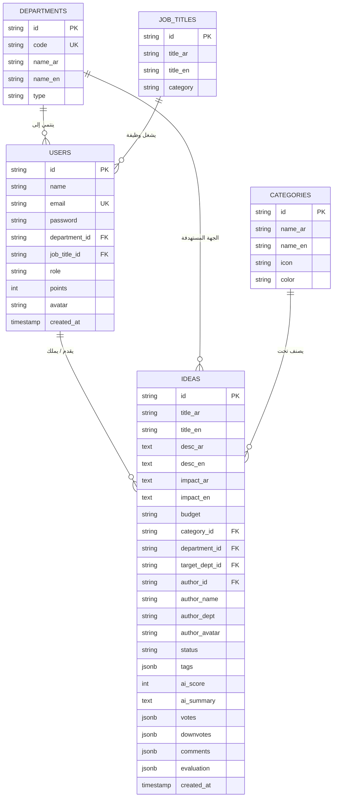

# وثيقة تصميم قاعدة البيانات وقاموس البيانات (Database Design Document & Data Dictionary)
### منصة فكرة (Fikra) — جامعة بيشة | University of Bisha
**الإصدار:** 2.0 | **التاريخ:** سبتمبر 2026 | **محرك قاعدة البيانات:** PostgreSQL 15+ (Supabase) / In-Memory JSON Store

---

## 📑 جدول المحتويات (Table of Contents)
1. [نظرة عامة على التصميم (Database Architecture Overview)](#1-نظرة-عامة-على-التصميم-database-architecture-overview)
2. [مخطط العلاقات الكيانية (Entity-Relationship Diagram - ERD)](#2-مخطط-العلاقات-الكيانية-entity-relationship-diagram---erd)
3. [قاموس البيانات المفصل (Detailed Data Dictionary)](#3-قاموس-البيانات-المفصل-detailed-data-dictionary)
   - جدول المستخدمين (`fikra_users`)
   - جدول الكليات والإدارات (`fikra_departments`)
   - جدول المسميات الوظيفية (`fikra_jobs`)
   - جدول تصنيفات ومجالات الابتكار (`fikra_categories`)
   - جدول الأفكار والمبادرات (`fikra_ideas`)
   - جدول إعدادات النظام (`fikra_settings`)
4. [هياكل البيانات المتداخلة (JSON Structures & Sub-Schemas)](#4-هياكل-البيانات-المتداخلة-json-structures--sub-schemas)
5. [قيود التكامل المرجعي والفهارس (Integrity Constraints & Indexing)](#5-قيود-التكامل-المرجعي-والفهارس-integrity-constraints--indexing)
6. [نصوص الإنشاء والتهيئة (PostgreSQL DDL Migration Script)](#6-نصوص-الإنشاء-والتهيئة-postgresql-ddl-migration-script)

---

## 1. نظرة عامة على التصميم (Database Architecture Overview)
تم تصميم قاعدة بيانات منصة **فكرة (Fikra)** وفق معايير قواعد البيانات العلائقية الحديثة (RDBMS) مع الاستفادة من مرونة حقول JSONB لتخزين التعليقات والمصفوفات التفاعلية وعناصر التقييم، مما يحقق أقصى سرعة قراءة واستجابة فورية.

---

## 2. مخطط العلاقات الكيانية (Entity-Relationship Diagram - ERD)



---

## 3. قاموس البيانات المفصل (Detailed Data Dictionary)

### 3.1. جدول المستخدمين (`fikra_users`)
يخزن بيانات حسابات منسوبي جامعة بيشة، الأدوار الوظيفية، ورصيد النقاط.

| الحقل (Column) | نوع البيانات (Data Type) | القيد (Constraint) | القيمة الافتراضية | الوصف |
| :--- | :--- | :--- | :--- | :--- |
| `id` | `VARCHAR(64)` | `PRIMARY KEY` | - | المعرف الفريد للمستخدم (مثل: `usr_17264100`) |
| `name` | `VARCHAR(255)` | `NOT NULL` | - | الاسم الرباعي الرسمي لمنسوب الجامعة |
| `email` | `VARCHAR(255)` | `UNIQUE, NOT NULL` | - | البريد الإلكتروني الجامعي (`@ub.edu.sa`) |
| `password` | `VARCHAR(255)` | `NOT NULL` | - | كلمة المرور المشفرة أو نص التحقق الآمن |
| `department_id` | `VARCHAR(64)` | `NULLABLE` | `null` | معرف الكلية أو العمادة التي يتبع لها الموظف |
| `job_title_id` | `VARCHAR(64)` | `NULLABLE` | `null` | معرف المسمى الوظيفي أو الرتبة الأكاديمية |
| `role` | `VARCHAR(32)` | `NOT NULL` | `'employee'` | دور المستخدم: `employee`, `committee`, `admin` |
| `points` | `INTEGER` | `NOT NULL` | `0` | رصيد نقاط التميز ولوحة الشرف |
| `avatar` | `TEXT` | `NULLABLE` | `null` | مسار أو رابط الصورة الشخصية |
| `created_at` | `TIMESTAMPTZ` | `NOT NULL` | `NOW()` | تاريخ ووقت تسجيل الحساب |

---

### 3.2. جدول الكليات والعمادات والإدارات (`fikra_departments`)
يحدد الهيكل التنظيمي لجامعة بيشة.

| الحقل (Column) | نوع البيانات | القيد | الوصف |
| :--- | :--- | :--- | :--- |
| `id` | `VARCHAR(64)` | `PRIMARY KEY` | المعرف الفريد للكلية (مثل `cs`, `engineering`, `medicine`) |
| `code` | `VARCHAR(32)` | `UNIQUE, NOT NULL` | الرمز التنظيمي المختصر (مثل `CS_IS`, `ENG`, `DSR`) |
| `name_ar` | `VARCHAR(255)` | `NOT NULL` | الاسم الرسمي بالعربية |
| `name_en` | `VARCHAR(255)` | `NOT NULL` | الاسم الرسمي بالإنجليزية |
| `type` | `VARCHAR(32)` | `NOT NULL` | نوع الكيان: `college`, `deanship`, `admin_dept` |

---

### 3.3. جدول المسميات الوظيفية (`fikra_jobs`)

| الحقل (Column) | نوع البيانات | القيد | الوصف |
| :--- | :--- | :--- | :--- |
| `id` | `VARCHAR(64)` | `PRIMARY KEY` | معرف المسمى الوظيفي (مثل `prof`, `assoc_prof`, `engineer`) |
| `title_ar` | `VARCHAR(255)` | `NOT NULL` | المسمى الوظيفي بالعربية |
| `title_en` | `VARCHAR(255)` | `NOT NULL` | المسمى الوظيفي بالإنجليزية |
| `category` | `VARCHAR(64)` | `NULLABLE` | التصنيف: `academic` (أكاديمي) أو `administrative` (إداري) |

---

### 3.4. جدول تصنيفات ومجالات الابتكار (`fikra_categories`)

| الحقل (Column) | نوع البيانات | القيد | الوصف |
| :--- | :--- | :--- | :--- |
| `id` | `VARCHAR(64)` | `PRIMARY KEY` | معرف المجال (مثل `digital_transformation`, `sustainability`) |
| `name_ar` | `VARCHAR(255)` | `NOT NULL` | اسم المجال بالعربية |
| `name_en` | `VARCHAR(255)` | `NOT NULL` | اسم المجال بالإنجليزية |
| `icon` | `VARCHAR(64)` | `NOT NULL` | أيقونة التصنيف (من مكتبة MDI Icons) |
| `color` | `VARCHAR(32)` | `NOT NULL` | كود اللون المميز (Hex Code) |

---

### 3.5. جدول الأفكار والمبادرات (`fikra_ideas`)
الجدول المركزي في المنصة، ويشمل محتوى الفكرة الثنائي والتقييمات والتصويت.

| الحقل (Column) | نوع البيانات | القيد | الوصف |
| :--- | :--- | :--- | :--- |
| `id` | `VARCHAR(64)` | `PRIMARY KEY` | المعرف الفريد للفكرة (مثل `idea_1726410000000`) |
| `title_ar` | `VARCHAR(500)` | `NOT NULL` | عنوان الفكرة باللغة العربية |
| `title_en` | `VARCHAR(500)` | `NULLABLE` | عنوان الفكرة باللغة الإنجليزية |
| `desc_ar` | `TEXT` | `NOT NULL` | الوصف المفصل للفكرة بالعربية |
| `desc_en` | `TEXT` | `NULLABLE` | الوصف المفصل بالإنجليزية |
| `impact_ar` | `TEXT` | `NULLABLE` | الأثر المتوقع والعائد المؤسسي بالعربية |
| `impact_en` | `TEXT` | `NULLABLE` | الأثر المتوقع بالإنجليزية |
| `budget` | `VARCHAR(128)` | `NULLABLE` | الميزانية التقديرية (مثال: `50,000 SAR`) |
| `category_id` | `VARCHAR(64)` | `REFERENCES fikra_categories(id)` | تصنيف ومجال الفكرة |
| `department_id` | `VARCHAR(64)` | `REFERENCES fikra_departments(id)` | كلية الموظف صاحب الفكرة |
| `target_dept_id` | `VARCHAR(64)` | `REFERENCES fikra_departments(id)` | الجهة المستهدفة بالتطبيق |
| `author_id` | `VARCHAR(64)` | `REFERENCES fikra_users(id)` | معرف صاحب الفكرة |
| `author_name` | `VARCHAR(255)` | `NOT NULL` | اسم صاحب الفكرة (Denormalized للسرعة) |
| `author_dept` | `VARCHAR(255)` | `NULLABLE` | كلية صاحب الفكرة |
| `author_avatar`| `TEXT` | `NULLABLE` | صورة الموظف |
| `status` | `VARCHAR(32)` | `NOT NULL DEFAULT 'submitted'` | حالة الفكرة: `submitted`, `under_review`, `approved`, `rejected`, `implemented` |
| `tags` | `JSONB` | `DEFAULT '[]'::jsonb` | مصفوفة الوسوم الذكية (Tags) |
| `ai_score` | `INTEGER` | `DEFAULT 80` | مؤشر جودة وأثر الفكرة من محرك الذكاء الاصطناعي (0-100) |
| `ai_summary` | `TEXT` | `NULLABLE` | الملخص الذكي المولد بواسطة الـ AI |
| `votes` | `JSONB` | `DEFAULT '[]'::jsonb` | مصفوفة معرفات المستخدمين الذين صوتوا إيجابياً |
| `downvotes` | `JSONB` | `DEFAULT '[]'::jsonb` | مصفوفة معرفات المستخدمين الذين صوتوا سلبياً |
| `comments` | `JSONB` | `DEFAULT '[]'::jsonb` | قائمة التعليقات والملاحظات النقاشية |
| `evaluation` | `JSONB` | `NULLABLE` | كائن تقييم لجنة التحكيم المعتمد |
| `created_at` | `TIMESTAMPTZ` | `NOT NULL DEFAULT NOW()` | تاريخ ووقت طرح الفكرة |

---

## 4. هياكل البيانات المتداخلة (JSON Structures & Sub-Schemas)

### 4.1. هيكل كائن التقييم (`evaluation` Object)
```json
{
  "strategicAlignment": 5,
  "feasibility": 4,
  "innovation": 5,
  "impact": 4,
  "totalScore": 92,
  "decision": "approved",
  "notes": "تمت الموافقة وتشكيل فريق عمل تنفيذي.",
  "evaluatorId": "usr_committee_01",
  "evaluatorName": "د. سارة القحطاني",
  "evaluatedAt": "2026-09-15T12:00:00.000Z"
}
```

### 4.2. هيكل عنصر التعليق (`comments` Array Item)
```json
{
  "id": "cmt_1726418800000",
  "authorId": "usr_emp_02",
  "authorName": "أ. نورة الغامدي",
  "authorAvatar": "assets/images/avatars/user2.png",
  "text": "فكرة رائدة ومفيدة جداً للطلاب وأعضاء هيئة التدريس.",
  "createdAt": "2026-09-15T13:45:00.000Z"
}
```

---

## 5. قيود التكامل المرجعي والفهارس (Integrity Constraints & Indexing)
لضمان سرعة البحث والتصفية، تم إنشاء الفهارس التالية في PostgreSQL:

```sql
-- فهارس تحسين الاستعلامات
CREATE INDEX idx_fikra_ideas_status ON fikra_ideas(status);
CREATE INDEX idx_fikra_ideas_target_dept ON fikra_ideas(target_dept_id);
CREATE INDEX idx_fikra_ideas_category ON fikra_ideas(category_id);
CREATE INDEX idx_fikra_ideas_created_at ON fikra_ideas(created_at DESC);
CREATE INDEX idx_fikra_users_email ON fikra_users(email);
```

---

## 6. نصوص الإنشاء والتهيئة (PostgreSQL DDL Migration Script)

```sql
-- DDL Script: Fikra Database Tables Schema for Supabase
CREATE TABLE IF NOT EXISTS fikra_departments (
  id VARCHAR(64) PRIMARY KEY,
  code VARCHAR(32) UNIQUE NOT NULL,
  name_ar VARCHAR(255) NOT NULL,
  name_en VARCHAR(255) NOT NULL,
  type VARCHAR(32) NOT NULL DEFAULT 'college'
);

CREATE TABLE IF NOT EXISTS fikra_jobs (
  id VARCHAR(64) PRIMARY KEY,
  title_ar VARCHAR(255) NOT NULL,
  title_en VARCHAR(255) NOT NULL,
  category VARCHAR(64) DEFAULT 'academic'
);

CREATE TABLE IF NOT EXISTS fikra_categories (
  id VARCHAR(64) PRIMARY KEY,
  name_ar VARCHAR(255) NOT NULL,
  name_en VARCHAR(255) NOT NULL,
  icon VARCHAR(64) NOT NULL,
  color VARCHAR(32) NOT NULL
);

CREATE TABLE IF NOT EXISTS fikra_users (
  id VARCHAR(64) PRIMARY KEY,
  name VARCHAR(255) NOT NULL,
  email VARCHAR(255) UNIQUE NOT NULL,
  password VARCHAR(255) NOT NULL,
  department_id VARCHAR(64) REFERENCES fikra_departments(id) ON DELETE SET NULL,
  job_title_id VARCHAR(64) REFERENCES fikra_jobs(id) ON DELETE SET NULL,
  role VARCHAR(32) NOT NULL DEFAULT 'employee',
  points INTEGER NOT NULL DEFAULT 0,
  avatar TEXT,
  created_at TIMESTAMPTZ NOT NULL DEFAULT NOW()
);

CREATE TABLE IF NOT EXISTS fikra_ideas (
  id VARCHAR(64) PRIMARY KEY,
  title_ar VARCHAR(500) NOT NULL,
  title_en VARCHAR(500),
  desc_ar TEXT NOT NULL,
  desc_en TEXT,
  impact_ar TEXT,
  impact_en TEXT,
  budget VARCHAR(128),
  category_id VARCHAR(64) REFERENCES fikra_categories(id) ON DELETE SET NULL,
  department_id VARCHAR(64) REFERENCES fikra_departments(id) ON DELETE SET NULL,
  target_dept_id VARCHAR(64) REFERENCES fikra_departments(id) ON DELETE SET NULL,
  author_id VARCHAR(64) REFERENCES fikra_users(id) ON DELETE SET NULL,
  author_name VARCHAR(255) NOT NULL,
  author_dept VARCHAR(255),
  author_avatar TEXT,
  status VARCHAR(32) NOT NULL DEFAULT 'submitted',
  tags JSONB DEFAULT '[]'::jsonb,
  ai_score INTEGER DEFAULT 80,
  ai_summary TEXT,
  votes JSONB DEFAULT '[]'::jsonb,
  downvotes JSONB DEFAULT '[]'::jsonb,
  comments JSONB DEFAULT '[]'::jsonb,
  evaluation JSONB,
  created_at TIMESTAMPTZ NOT NULL DEFAULT NOW()
);

-- Enable Row Level Security (RLS)
ALTER TABLE fikra_ideas ENABLE ROW LEVEL SECURITY;
ALTER TABLE fikra_users ENABLE ROW LEVEL SECURITY;
ALTER TABLE fikra_departments ENABLE ROW LEVEL SECURITY;
ALTER TABLE fikra_categories ENABLE ROW LEVEL SECURITY;
ALTER TABLE fikra_jobs ENABLE ROW LEVEL SECURITY;

-- Allow Public Read and Anon Key Access
CREATE POLICY "Public Read All Ideas" ON fikra_ideas FOR SELECT USING (true);
CREATE POLICY "Allow All Insert Ideas" ON fikra_ideas FOR INSERT WITH CHECK (true);
CREATE POLICY "Allow All Update Ideas" ON fikra_ideas FOR UPDATE USING (true);
```
