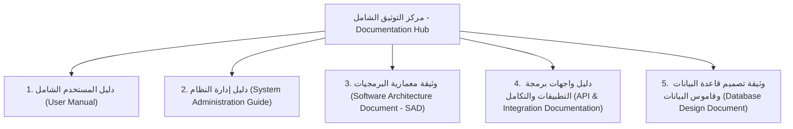

# مركز التوثيق الشامل لمنصة فكرة (Fikra Documentation Hub)
### جامعة بيشة | University of Bisha
**الإصدار:** 2.0 | **التاريخ:** سبتمبر 2026 | **الحالة:** مكتمل ومعتمد رسمياً

---

## 📚 حزمة الوثائق الفنية والتشغيلية (Documentation Suite)

مرحباً بك في مركز التوثيق الرسمي والشامل لمنصة **فكرة (Fikra)** — نظام إدارة الابتكار والأفكار المؤسسية في جامعة بيشة. تم إعداد هذه الوثائق وفق أحدث المعايير البرمجية والأكاديمية العالمية لتغطية كافة متطلبات المستخدمين، مديري النظام، المهندسين، ومطوري التكامل:

---

## 🗂️ فهرس المستندات والروابط السريعة (Documentation Index)

### 1. [دليل المستخدم (User Manual)](file:///c:/Users/ezzoa/OneDrive/Documents/Desktop/Projects/bsha/docs/01_USER_MANUAL.md)
- **الجمهور المستهدف:** أعضاء هيئة التدريس، الموظفون، الباحثون، وأعضاء لجان التحكيم.
- **أبرز المحاور:**
  - خطوات تسجيل الدخول واستعادة كلمة المرور.
  - طريقة طرح المبادرات والأفكار واستخدام الإدخال الصوتي (Speech-to-Text).
  - التفاعل مع رادار الذكاء الاصطناعي لكشف الأفكار المتشابهة (AI Duplicate Radar).
  - خطوات تقييم وتحكيم الأفكار وفق مصفوفة المعايير الرباعية لجامعة بيشة.
  - استعراض لوحة الشرف ونظام النقاط وتصدير وثائق الأفكار بصيغة PDF.

---

### 2. [دليل إدارة النظام (System Administration Guide)](file:///c:/Users/ezzoa/OneDrive/Documents/Desktop/Projects/bsha/docs/02_SYSTEM_ADMINISTRATION_GUIDE.md)
- **الجمهور المستهدف:** مسؤولو النظام، عمادة تقنية المعلومات، ومديرو الصلاحيات.
- **أبرز المحاور:**
  - نموذج الصلاحيات والأدوار (Role-Based Access Control - RBAC).
  - إدارة القوائم المنسدلة الديناميكية (الكليات، المسميات الوظيفية، مجالات الابتكار).
  - إدارة المستخدمين وتعيين المحكمين.
  - ضبط حساسية خوارزمية الذكاء الاصطناعي ومعاملات التشابه الدلالي (AI Thresholds).
  - إدارة المزامنة السحابية مع Supabase وإجراءات إعادة الضبط المصنعي (Factory Reset).

---

### 3. [وثيقة معمارية البرمجيات (Software Architecture Document - SAD)](file:///c:/Users/ezzoa/OneDrive/Documents/Desktop/Projects/bsha/docs/03_SOFTWARE_ARCHITECTURE_DOCUMENT.md)
- **الجمهور المستهدف:** كبار مهندسي البرمجيات، مهندسو النظم، ومحللو الحلول التقنية.
- **أبرز المحاور:**
  - معمارية التطبيق وحيد الصفحة (SPA) بنمط المصدر الموحد للحقيقة (SSOT).
  - تفكيك المكونات البرمجية والمسؤوليات.
  - خوارزمية معالجة اللغات الطبيعية (NLP Pipeline) لتطبيع النصوص ومطابقة الجاكارد اللغوية.
  - دورة حياة المزامنة الهجينة (Offline-first + Cloud Sync).
  - معايير الأمان، إمكانية الوصول (WCAG 2.1 AA)، والتوافرية العالية.

---

### 4. [دليل واجهات برمجة التطبيقات والتكامل (API & Integration Documentation)](file:///c:/Users/ezzoa/OneDrive/Documents/Desktop/Projects/bsha/docs/04_API_AND_INTEGRATION_DOCUMENTATION.md)
- **الجمهور المستهدف:** مطورو الواجهات الخلفية (Backend Developers) وفرق التكامل الخارجي.
- **أبرز المحاور:**
  - ترويسات المصادقة ومفاتيح الأمان.
  - نقاط النهاية لـ RESTful API لإدارة الأفكار، المستخدمين، التقييمات، والهيكل الأكاديمي.
  - عقود التكامل مع Google Gemini Pro و Web Speech API.
  - اشتراكات البث اللحظي عبر WebSockets (Postgres Changes Realtime).
  - رموز الاستجابة ومعالجة الأخطاء.

---

### 5. [وثيقة تصميم قاعدة البيانات وقاموس البيانات (Database Design Document)](file:///c:/Users/ezzoa/OneDrive/Documents/Desktop/Projects/bsha/docs/05_DATABASE_DESIGN_DOCUMENT.md)
- **الجمهور المستهدف:** مسؤولو قواعد البيانات (DBAs)، مهندسو البيانات، والمطورون.
- **أبرز المحاور:**
  - مخطط العلاقات الكيانية الكامل (ERD).
  - قاموس البيانات المفصل لجميع الجداول (`fikra_users`, `fikra_ideas`, `fikra_departments`, `fikra_categories`, `fikra_jobs`, `fikra_settings`).
  - هياكل الحقول المتداخلة (JSON Schemas) للملاحظات والتقييمات والتصويت.
  - فهارس الأداء وقواعد التكامل المرجعي وسياسات أمان مستوى الصفوف (Row Level Security - RLS).
  - نصوص SQL DDL الجاهزة للتشغيل والترقية.

---

## 🏛️ جامعة بيشة (University of Bisha)
جميع الحقوق محفوظة © 2026 — عمادة تقنية المعلومات ومحرك الابتكار المؤسسي.
